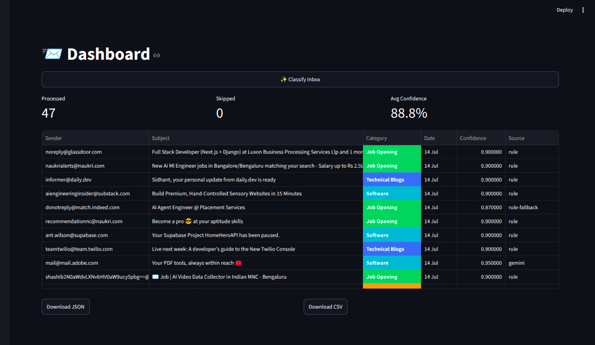
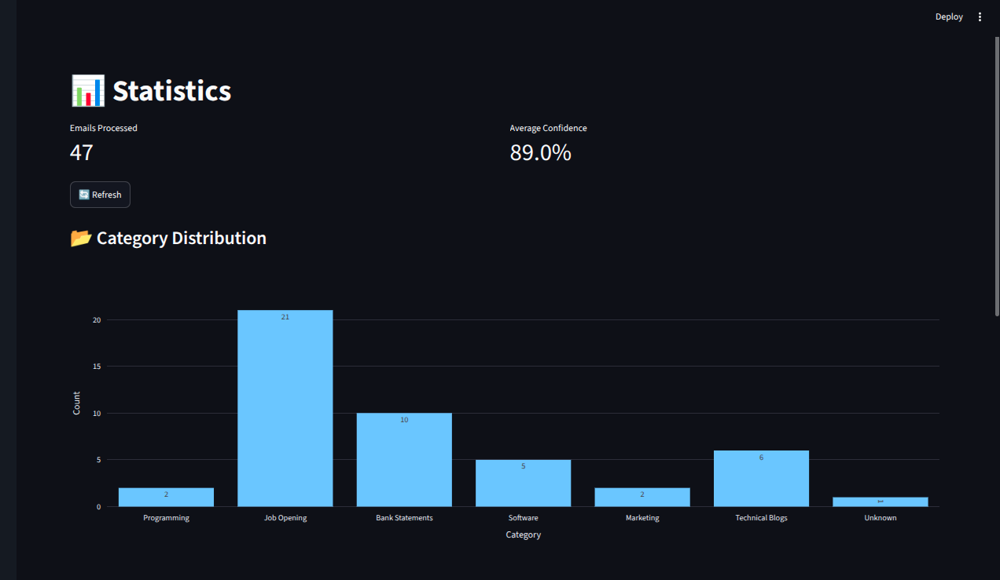

# 📧 AI Email Organizer

An AI-powered Gmail email organizer that automatically classifies incoming emails using a **multi-stage hybrid classification pipeline** combining a **Rule Engine**, **Hugging Face Zero-Shot Classification**, and **Gemini LLM**, then applies Gmail labels automatically.

The project is designed as a production-inspired MVP focusing on **accuracy, explainability, observability, and extensibility** rather than simply calling an LLM for every email.

---

## Demo

| Dashboard                                                    | Statistics                                               |
| ------------------------------------------------------------ | -------------------------------------------------------- |
|  |  |

---

# Features

- Google OAuth 2.0 Authentication
- Gmail API Integration
- Automatic Inbox Classification
- Gmail Label Creation & Assignment
- Multi-stage Hybrid AI Pipeline
- Explainable AI Decisions
- Automatic Classification Logging
- Dataset Generation for Future Fine-Tuning
- Statistics Dashboard
- JSON & CSV Export
- Modern Streamlit UI

---

# Why this project?

Most AI email organizers simply send every email to an LLM.

That approach has several drawbacks:

- Expensive
- Slow
- Difficult to explain
- Not deterministic
- Doesn't scale well

This project instead follows a **hybrid decision pipeline**, where simple emails are handled using deterministic rules while more complex emails are progressively escalated to AI models only when required.

This significantly reduces latency, inference cost, and unnecessary LLM calls while maintaining good classification quality.

---

# Architecture

```
                   Gmail API
                       │
                       ▼
                Email Parser
                       │
                       ▼
               Decision Engine
                       │
        ┌──────────────┼──────────────┐
        ▼              ▼              ▼
    Rule Engine    HuggingFace      Gemini
      │               │              │
      └────── Decision Trace ────────┘
                       │
          Gmail Label Assignment
                       │
                       ▼
        classification_history.jsonl
                       │
             Candidate Dataset Builder
                       │
                       ▼
        candidate_dataset.jsonl
```

---

# Classification Pipeline

Every email passes through a hybrid decision engine.

```
Email
  │
  ▼
Rule Engine
  │
  ├── High Confidence
  │       │
  │       ▼
  │    Return Result
  │
  └── Low Confidence
          │
          ▼
 HuggingFace Zero-Shot
          │
          ├── High Confidence
          │       │
          │       ▼
          │   Return Result
          │
          └── Low Confidence
                  │
                  ▼
              Gemini LLM
                  │
                  ▼
           Final Classification
```

This approach keeps most classifications inexpensive while allowing difficult emails to leverage larger language models.

---

# Categories

The current classifier supports:

- Job Opening
- Technical Blogs
- Programming
- Software
- Marketing
- Bank Statements
- Personal
- Fitness and Gym
- Unknown

The architecture allows additional categories to be added with minimal changes.

---

# Tech Stack

## Backend

- FastAPI
- SQLAlchemy
- SQLite
- Gmail API
- Google OAuth 2.0
- Pydantic
- HuggingFace Hub
- Gemini API

## Frontend

- Streamlit
- Pandas
- Plotly

---

# Project Structure

```
.
├── app
│   ├── api
│   ├── classifiers
│   ├── core
│   ├── database
│   ├── services
│   └── evaluation
│
├── frontend
│   ├── pages
│   ├── components
│   └── services
│
├── scripts
│
├── data
│   ├── classification_history.jsonl
│   └── candidate_dataset.jsonl
│
└── README.md
```

---

# How it Works

## 1. Authenticate

The user signs in using Google OAuth.

The application securely stores Gmail access tokens and retrieves emails through the Gmail API.

---

## 2. Parse Emails

Each email is parsed into a structured format containing:

- Sender
- Sender Domain
- Subject
- Snippet
- Received Timestamp

---

## 3. Classification

The Decision Engine evaluates the email.

Possible decision sources:

- Rule Engine
- HuggingFace
- Gemini

Each decision contains:

- Category
- Confidence
- Reasons
- Model Used

---

## 4. Gmail Labels

After classification the application:

- Creates missing Gmail labels automatically
- Applies labels to emails
- Preserves existing Gmail labels

---

## 5. Logging

Every processed email is stored in:

```
classification_history.jsonl
```

Each record contains:

- Parsed email
- Rule prediction
- HF prediction
- Gemini prediction
- Final decision
- Decision source
- Model used
- Confidence

This makes the pipeline fully traceable and explainable.

---

## 6. Dataset Generation

The project can automatically generate candidate datasets from historical classifications.

```
classification_history.jsonl

↓

build_dataset.py

↓

candidate_dataset.jsonl
```

These datasets can later be manually reviewed and used for model fine-tuning or evaluation.

---

# API Endpoints

## Authentication

```
GET /auth/login
GET /auth/callback
```

---

## Gmail

```
GET /gmail/messages
```

---

## Classification

```
POST /classify/inbox
```

Classifies new emails, assigns Gmail labels, and stores classification history.

---

## History

```
GET /history
```

Returns previously classified emails.

---

## Statistics

```
GET /stats
```

Returns:

- Total emails processed
- Category distribution
- Decision source distribution
- Average confidence
- Model usage

---

## Health Check

```
GET /health
```

---

# Dashboard

The Streamlit dashboard provides:

- Gmail Authentication
- One-click Inbox Classification
- Classification History
- Confidence Scores
- JSON Export
- CSV Export

---

# Statistics

The Statistics page visualizes:

- Category Distribution
- Decision Source Distribution
- Model Usage
- Average Confidence

---

# Explainability

Every prediction is explainable.

Example:

```json
{
  "category": "Job Opening",
  "confidence": 0.92,
  "decision_source": "rule",
  "model": "rule-engine-v1",
  "reasons": ["Sender matched LinkedIn", "Subject contains 'Software Engineer'"]
}
```

---

# Running Locally

## Clone

```bash
git clone https://github.com/yourusername/ai-email-organizer.git

cd ai-email-organizer
```

---

## Backend

```bash
uv sync

uv run uvicorn app.main:app --reload
```

---

## Frontend

```bash
cd frontend

uv sync

streamlit run app.py
```

---

# Environment Variables

Create a `.env` file.

```
GOOGLE_CLIENT_ID=

GOOGLE_CLIENT_SECRET=

HF_API_KEY=

GEMINI_API_KEY=

SECRET_KEY=
```
---

# License

MIT License

---

## Acknowledgements

- Google Gmail API
- Hugging Face
- Google Gemini
- FastAPI
- Streamlit
